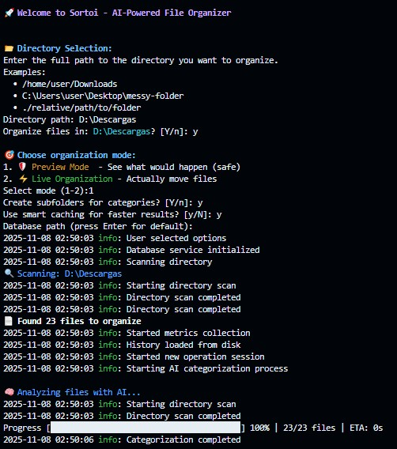
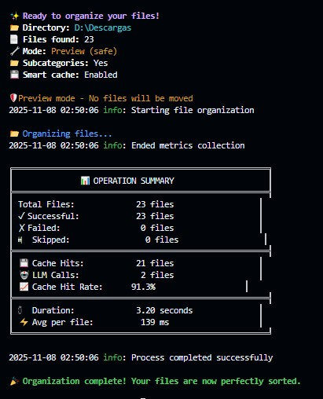

# Sortoi

AI-powered intelligent file organizer.  
Crafted with Kilo Code, GitHub Copilot, Claude Web, and the strategic guidance of a human developer.

[](LICENSE)
[](https://www.typescriptlang.org/)
[](https://nodejs.org/)

[Quick Start](#-quick-start) • [Usage Guide](#-usage-guide) • [Vibe Coding Methodology](docs/VIBE_CODING_WITH_REFERENCES.md) • [Report Issues](https://github.com/Atypical-Playworks/sortoi/issues)

---

## 🎯 What is Sortoi?

**Sortoi** is an intelligent CLI tool that uses Google Gemini AI to automatically categorize and organize your files. Beyond simple file extensions, it understands content and context to create meaningful, hierarchical folder structures.

### See Sortoi in Action

<table>
  <tr>
    <td></td>
    <td></td>
  </tr>
  <tr>
    <td align="center"><em>🎯 Interactive Mode - Guided Setup</em></td>
    <td align="center"><em>🤖 AI Categorizing Your Files</em></td>
  </tr>
</table>

### For Everyone

- 📁 **Home Users**: Tame your chaotic Downloads folder in seconds
- 💼 **Professionals**: Organize projects, assets, and archives intelligently
- 🎨 **Creators**: Sort media files by content, not just extension

### ✨ Key Features

- 🧠 **AI-Powered**: Uses Google Gemini 2.0 Flash for deep file understanding
- 📂 **Smart Organization**: Creates Category/Subcategory folder structures
- ⚡ **Lightning Fast**: Complete analysis in seconds with caching
- 🛡️ **Safe by Default**: Dry-run mode lets you preview before moving
- 🔄 **Undo System**: Full history tracking with one-command rollback
- 🎯 **Two Modes**: Interactive (guided) or CLI (advanced)
- 🆓 **Forever Free**: No sign-up, just your Google AI API key

---

## 🚀 Quick Start

### Prerequisites
```bash
Node.js 18+ | pnpm or npm | Google AI API key
```
Get your API key: [Google AI Studio](https://aistudio.google.com/app/apikey)

### Installation

```bash
# Global installation (recommended)
npm install -g sortoi

# Or with pnpm
pnpm add -g sortoi
```

### First Run

```bash
# Interactive mode (easiest)
sortoi

# The tool will guide you through:
# 1. Enter your Google AI API key
# 2. Select directory to organize
# 3. Choose preview or live mode
# 4. Watch the magic happen ✨
```

---

## 💻 Usage Guide

### 🎯 Interactive Mode (Beginner-Friendly)

Just run `sortoi` and follow the prompts:

```bash
sortoi
```

**What you'll do:**
1. 📂 **Select Directory**: Enter path like `C:\Users\YourName\Downloads`
2. 🎯 **Choose Mode**: Preview (safe) or Live (organize now)
3. 📁 **Configure**: Enable subcategories, caching
4. ✨ **Watch**: AI categorizes and organizes your files

**Example:**
```
🚀 Welcome to Sortoi

📂 Directory path: C:\Users\Milumon\Downloads
🎯 Mode: 1. Preview (safe) or 2. Live
Select: 1

🔍 Scanning... Found 42 files
� Analyzing with AI...

✨ Preview - Would organize:
  invoice.pdf → Documents/Invoices/
  vacation.jpg → Images/Photos/
  tutorial.mp4 → Videos/Educational/
```

---

### ⚡ CLI Mode (Power Users)

Direct commands for advanced workflows:

#### Basic Commands

```bash
# Organize directory
sortoi /path/to/folder

# Preview first (safe)
sortoi ~/Downloads --dry-run

# Flat structure (no subcategories)
sortoi ~/Documents --no-subcategories

# With custom cache database
sortoi ~/Projects --db ./my-cache.db
```

#### Advanced Features

```bash
# History & Rollback
sortoi history list                    # View all sessions
sortoi history show <session-id>       # Details of a session
sortoi history rollback <session-id>   # Undo organization

# Verbose logging
sortoi ~/Downloads --verbose

# JSON output (for scripts)
sortoi ~/Downloads --json
```

---

### 📋 All CLI Options

```
sortoi [directory] [options]

Arguments:
  directory                 Path to organize

Options:
  -V, --version            Version number
  -i, --interactive        Interactive mode (guided)
  -d, --db <path>          Cache database path
  --no-subcategories       Flat structure (Category only)
  --dry-run                Preview without moving files
  --verbose                Detailed logging
  --json                   JSON output
  -h, --help               Show help

History Commands:
  sortoi history list                  List all sessions
  sortoi history show <id>             Show session details
  sortoi history rollback <id>         Undo organization
```

---

### 🎨 Common Scenarios

#### Scenario 1: First Time - Preview Mode
```bash
sortoi ~/Downloads --dry-run
```
**Output:**
```
📄 Found 15 files

DRY RUN - Would organize:
  invoice-2024.pdf → Documents/Invoices/
  beach.jpg → Images/Photos/
  tutorial.mp4 → Videos/Educational/
```

#### Scenario 2: Organize with Caching
```bash
sortoi ~/Documents --db ~/cache.db
```
**Benefit:** 10x faster on re-runs, only analyzes changed files

#### Scenario 3: Flat Structure
```bash
sortoi ~/Projects --no-subcategories
```
**Result:** Files sorted into main categories only (no subcategories)

#### Scenario 4: Made a Mistake? Rollback!
```bash
# Organize
sortoi ~/Downloads

# Oops! Undo it
sortoi history list
sortoi history rollback <session-id>
```

#### Scenario 5: JSON for Automation
```bash
sortoi ~/Downloads --json > results.json
```
**Use case:** Integrate with other tools, scripts, or dashboards

---

## 🏗️ Architecture

Built with production-ready technologies:

- **TypeScript 5** - End-to-end type safety
- **Google Gemini AI 2.0 Flash** - Intelligent categorization
- **SQLite** - Smart caching with hash validation
- **Clean Architecture** - SOLID principles, scalable structure
- **Node.js 22** - Modern runtime with ESM support

---

## 🎯 How It Works

1. **Scan**: Reads all files in the directory
2. **Hash**: Generates SHA-256 hash for cache validation
3. **Analyze**: AI categorizes files (or uses cached result)
4. **Organize**: Creates folder structure and moves files
5. **Track**: Records operation in history for rollback

**Smart Caching:** Only re-analyzes files that changed (hash mismatch)

---

## 📄 License

**MIT License** - Open Source

Sortoi is free and open source software. Feel free to use, modify, and distribute it.

See the [LICENSE](LICENSE) file for details.

---

## 🙏 Credits

> **Built for those who need it. By someone who did.**

*I built this because I needed to organize my files. My 'Downloads' folder was a complete mess, and no existing tool really helped me.*

**A project by [Atypical-Playworks](https://github.com/Atypical-Playworks)**  
**Developed by [Miluska Romero](https://github.com/Milumon)**